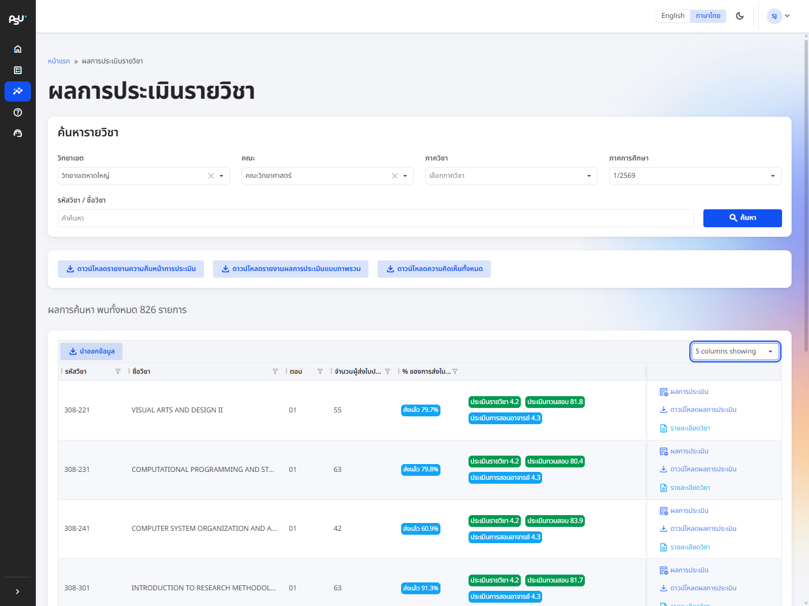

# Course evaluation results

<figure><figcaption>
The course evaluation result search and table view, with report download buttons
</figcaption></figure>

This page lets you view the evaluation results of every course within your scope. Search conveniently using the campus, faculty, department and semester filters together with a keyword (course code or course name).

Results appear as a table showing the course code, course name, section, semester, academic year, number of respondents, submission percentage, and the average score for each evaluation type. You can also drill into an individual course for details such as its unit, teaching lecturers, and Course Learning Outcomes (CLO).

From here you can view the results in table form, or download them as an Excel file (.xlsx) — the same layout the lecturer result page produces.

You can also download overview reports for the whole search result in one go: an evaluation progress report for every course found, an overview result report, and a report of all comments (Excel .xlsx). The buttons sit next to the course search box.


Reports follow whatever you searched for. For a complete overview, search without specifying campus, faculty, department or keyword. If you belong to a campus or faculty, the system conveniently sets the default scope to your own unit.

