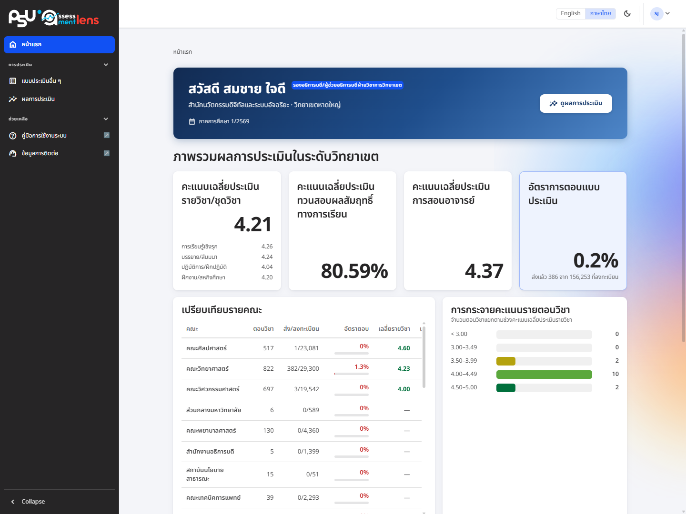

# Evaluation overview

<figure><figcaption>
The executive homepage: a welcome bar scoped to your unit, a results button, and the overview dashboard
</figcaption></figure>

The executive homepage is designed to give you the whole picture quickly. It greets you and shows your role and the scope you are responsible for (faculty/campus), the current semester, and a **"View results"** button that opens the course evaluation result search straight away.

What you see adapts to your access level, so it matches the scope you are responsible for.

* **University level** — an overview of all 5 campuses, showing only the topics shared by all 5 campuses
* **Campus level** — your own campus only, with the university's topics plus any other topics configured at campus level
* **Faculty level** — your own faculty only, with the university's and campus's topics plus any other topics configured at faculty level

## Overview dashboard

Some roles also see an overview dashboard with summary number cards (for example, the number of users or enrolled students, and the number of sections) and summary charts such as the evaluation submission rate — a convenient way to see broad trends and support policy decisions.
