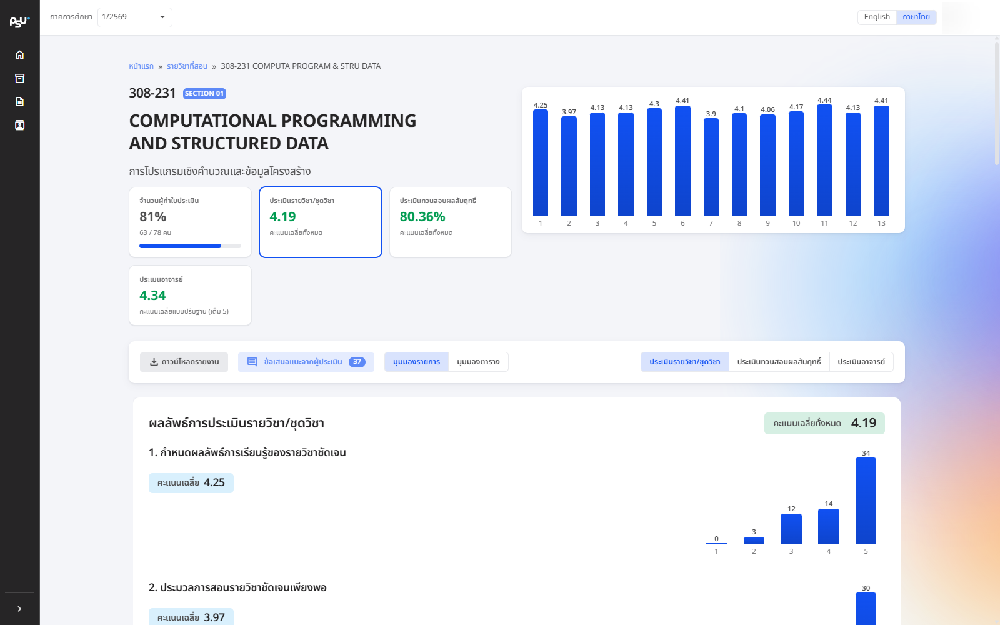
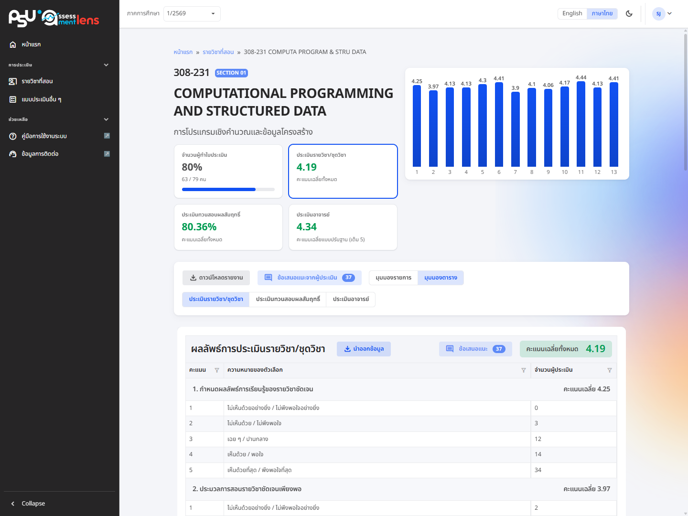
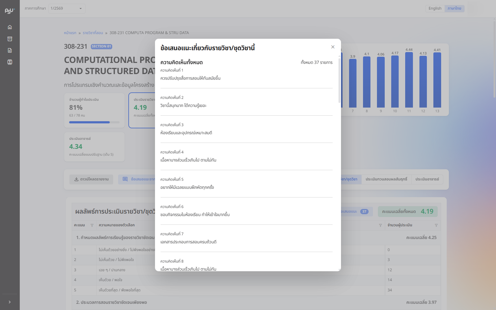

# Course evaluation results

<figure><figcaption>
The course evaluation result page: metric cards, charts and per-topic results
</figcaption></figure>

The course evaluation result page pulls everything together. It starts with the course heading (course code, section, course name) and a row of metric cards:

* **Response rate** — the number of people who completed the evaluation compared with the number of students enrolled, with a progress bar
* **Average score** for each type (course/module assessment, learning outcome validation, instructor evaluation). Select a score card to switch to the results for that type. The instructor evaluation score is also shown as an **adjusted average score (out of 5)** so the types can be compared easily

Below is a bar chart of average scores per topic, plus a toolbar with the **Download report** button, the **Feedback / Suggestion** button (with a badge showing how many comments there are), and a **List View / Table View** toggle — read the results whichever way suits you.

<figure><figcaption>
Evaluation results shown in table view
</figcaption></figure>

To read students' comments in full, press **Feedback / Suggestion**. Names are never shown, and comments about the course are kept clearly separate from comments about the lecturer.

<figure><figcaption>
The dialog for reading student feedback (respondents are never identified)
</figcaption></figure>

## Result report (Excel file)

If you want to keep the results, download the report as an Excel file (.xlsx). It contains 4 sheets covering every angle (sheet names are in Thai in both languages of the interface):

* Sheet 1 — "ผลการประเมินรายวิชา-ชุดวิชา" (course details and course/module assessment results)
* Sheet 2 — "ผลการประเมินทวนสอบผลสัมฤทธิ์" (learning outcome validation results)
* Sheet 3 — "ผลการประเมินการสอนอาจารย์" (instructor evaluation results)
* Sheet 4 — "ข้อคิดเห็นหรือข้อเสนอแนะ" (all comments)


If a course has several lecturers, the course coordinator (the lecturer set as teaching lecturer **number 1** of the section) sees the scores and comments for every lecturer. Other lecturers see only their own results.



If the result visibility setting for that course is still switched off, the system shows nothing and displays a message saying the results for this course cannot be viewed yet. Wait until visibility is turned on.

