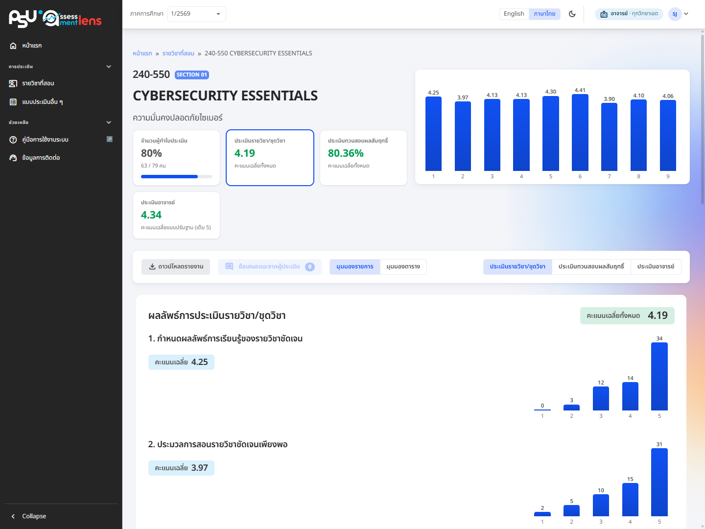
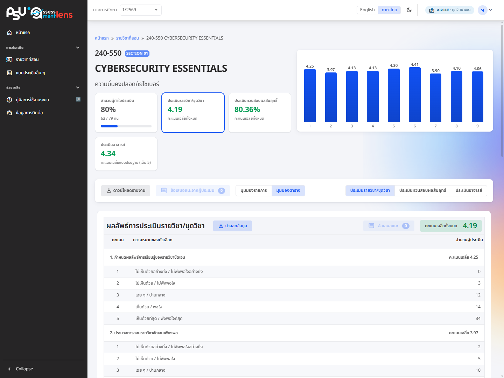
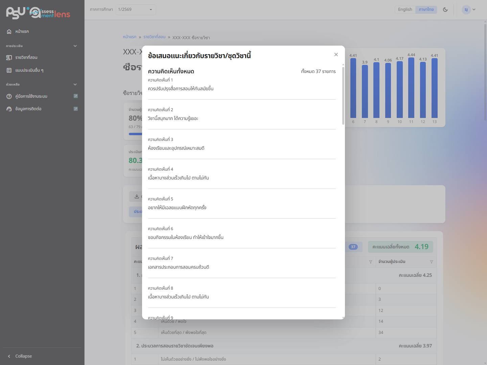

# Course evaluation results

<figure><figcaption>
The course evaluation result page: metric cards, charts and per-topic results
</figcaption></figure>

The course evaluation result page pulls everything together. It starts with the course heading (course code, section, course name) and a row of metric cards:

* **Number of responders in the evaluation** — the number of people who completed the evaluation compared with the number of students enrolled, with a progress bar
* **Average score** for each type (course/module assessment, self-assessment, instructor evaluation). Select a score card to switch to the results for that type. The instructor evaluation score is also shown as an **adjusted average score (out of 5)** so the types can be compared easily

Below is a bar chart of average scores per topic, plus a toolbar with the **Download Excel** and **Download PDF** buttons, the **Feedback / Suggestion** button (with a badge showing how many comments there are), and a **List View / Table View** toggle — read the results whichever way suits you.

<figure><figcaption>
Evaluation results shown in table view
</figcaption></figure>

To read students' comments in full, press **Feedback / Suggestion**. Names are never shown, and comments about the course are kept clearly separate from comments about the lecturer.

<figure><figcaption>
The dialog for reading student feedback (respondents are never identified)
</figcaption></figure>

## Result report (Excel and PDF)

If you want to keep the results, you can download the report in two formats. The report follows the language you are using the interface in (Thai or English).

**Excel file (.xlsx)** — 4 sheets covering every angle (sheet names are in Thai in both languages of the interface):

* Sheet 1 — "ผลการประเมินรายวิชา-ชุดวิชา" (course details and course/module assessment results)
* Sheet 2 — "ผลการประเมินตนเอง" (self-assessment results)
* Sheet 3 — "ผลการประเมินการสอนอาจารย์" (instructor evaluation results)
* Sheet 4 — "ข้อคิดเห็นหรือข้อเสนอแนะ" (all comments)

**PDF file** — an A4 report ready to print or attach to a quality-assurance file. It covers the course/module assessment, the self-assessment against the learning outcomes (CLO) and comments about the course. It does **not** include the instructor evaluation or comments addressed to lecturers; use the Excel file for those.


If a course has several lecturers, every lecturer sees **only their own** teaching scores and the comments addressed to them, on screen and in the downloaded reports, whatever their position in the section. The course assessment and self-assessment results belong to the whole section, so every lecturer sees the same ones.



Some courses do not require the self-assessment. Their result page shows "This course does not require the self-assessment." in place of that score, while the course and instructor results display as usual.



If the result visibility setting for that course is still switched off, the system shows nothing and displays a message saying the results for this course cannot be viewed yet. Wait until visibility is turned on.

