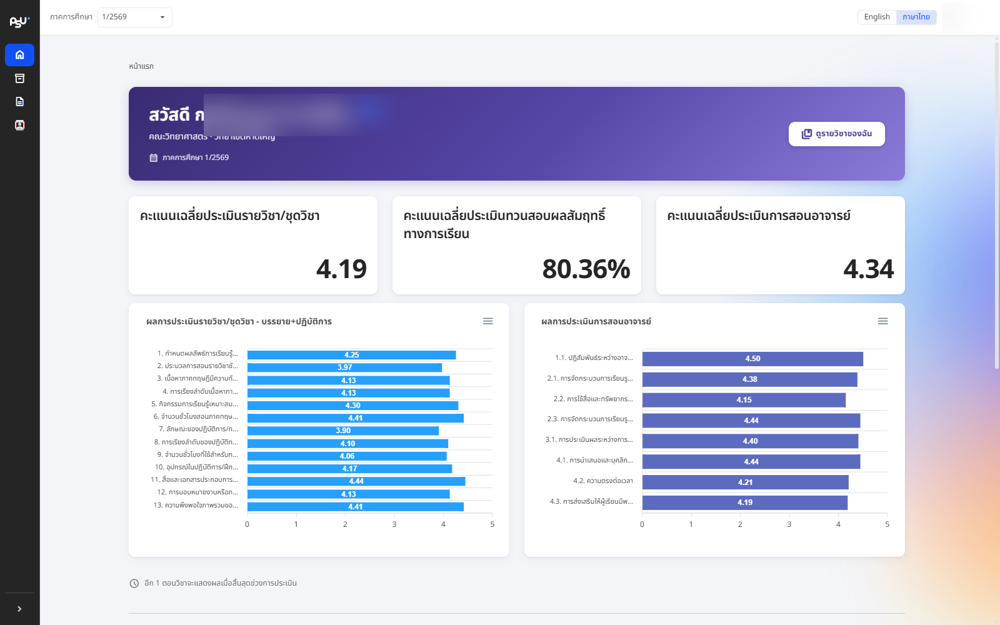
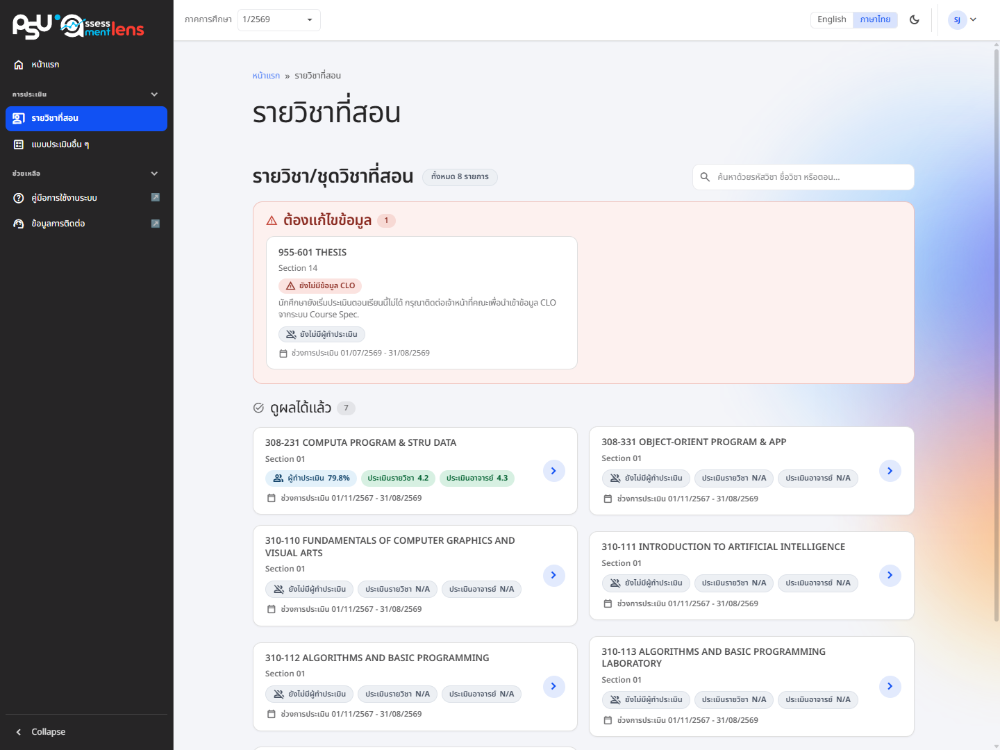

# Evaluation overview and courses taught

<figure><figcaption>
The lecturer homepage: score overview and courses taught
</figcaption></figure>

When a lecturer signs in, the homepage greets you and shows your role, your faculty/campus and the current semester, along with a **"View my courses"** shortcut that takes you straight to the courses you teach.

Below that is an overview of the average scores for each type of evaluation, so you get the whole picture on one page.

* Average score for the course/module assessment
* Learning outcome validation results — the system links to the Course Spec. and reports the achievement level as either 50% and above, or below 50%
* Average score for the lecturer teaching evaluation. Respondents who chose N/A or gave no opinion are excluded from the average, so the number reflects only those who actually scored you

## Courses/subjects taught

The system lists every course you teach. Each one shows the course code, course name, section, the proportion of students who have submitted their evaluation compared with the number enrolled, and the status of the evaluation period.


For fairness and to protect respondents' confidentiality, lecturers can only view results after the evaluation period has ended **and** the grades for that course have been released or submitted.


<figure><figcaption>
Courses taught, showing submission rates and average scores once results have been released
</figcaption></figure>

Once the evaluation period is over and results have been released, the course card switches to showing average scores. Select it to open the detailed evaluation results.
