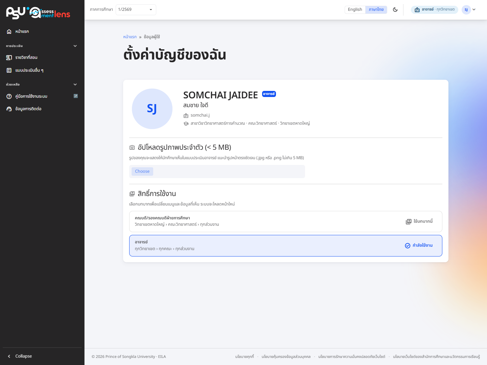
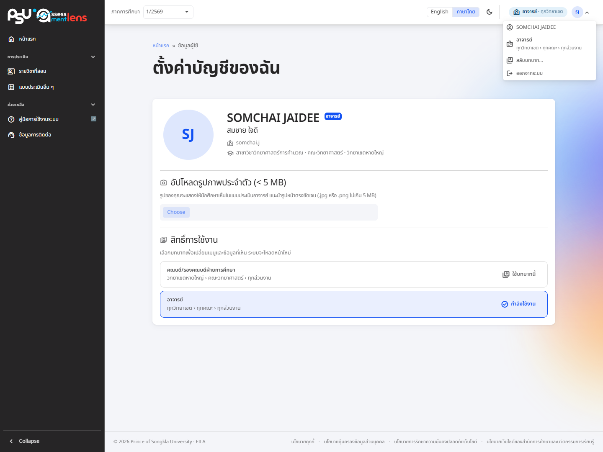

# Profile settings

<figure><figcaption>
The Account Setting page: account details, your list of roles, and photo upload
</figcaption></figure>

Open this page from the top-right corner of the system: select your avatar (your initials) to open a menu that shows your name and the role you are using, with its scope (campus › faculty › unit). Select the name or the role to reach **"Account Setting"**, which brings together your account details (Thai/English name, email, username), your unit (department · faculty · campus) and your roles in one place.

<figure><figcaption>
The profile menu at the top right: name, current role, Switch role, and Sign out
</figcaption></figure>

On a desktop screen a chip next to the avatar shows the current role and campus (hover for the full scope). On a phone your name and role sit at the top of the side menu instead.

## Switching roles

Some people hold more than one role (for example, both lecturer and executive). There are two ways to switch, neither requires signing out:

* **From the profile menu**, choose **"Switch role…"** (only shown to people with more than one role) and pick a role in the dialog that opens.
* **From the Account Setting page**, the **roles** section lists every role with its scope. The one in use is marked **"Current role"**; the others have a **"Use this role"** button.

Either way the system asks you to confirm, then reloads the page. The side menu and the data you see change to the new role immediately.

## Profile photo

Lecturers (and course coordinators) can upload a profile photo of up to **5 MB** in `.jpg` or `.png` format. The photo is shown to students when they evaluate teaching (see the [Instructor Evaluation](../student/evaluation.md#3.-instructor-evaluation) part for how it looks), and you can remove it at any time.


Use a clear, appropriate portrait so students recognise you and evaluate the right person.



Students don't need to upload a profile photo — their evaluation answers are confidential anyway.

