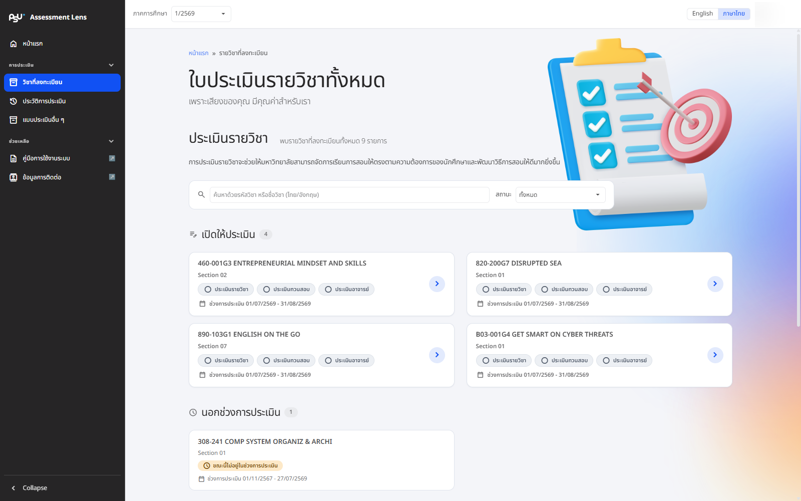

# My Courses

<figure><figcaption>
Every enrolled course, grouped by evaluation status, with a search box and filters
</figcaption></figure>

The **"Enrolled Courses"** page lists every course you are enrolled in this semester. Even with a long list it stays easy to search: type the course code or course name (Thai or English) in the search box, or filter by status using the box above. Press **"Clear filters"** to see everything again.

## Course statuses

Courses are grouped by evaluation status, so you can tell at a glance which ones you can do now and which ones have to wait.

* **Open for evaluation** — the evaluation window is open right now; go ahead and complete it
* **Outside evaluation period** — it is either not open yet, or the window for that course has already closed
* **Not available for evaluation** — the course is not fully set up yet (for example, the lecturer has not defined topics or learning outcomes), so it cannot be evaluated at the moment
* **Not open for evaluation** — the course is not offered for evaluation in the system
* **Submitted** — you have already sent your evaluation. Nicely done!

Each course shows its course code, name and section, the status of all 3 evaluation parts, and the dates the evaluation window is open, so you can plan ahead.

Select a course to start it, or to carry on where you left off. For a course you have already submitted, opening it shows what you answered as a read-only record.


Can't find a course you are enrolled in, or does something look wrong? Contact the faculty officer responsible for that course and they will look into it for you.

