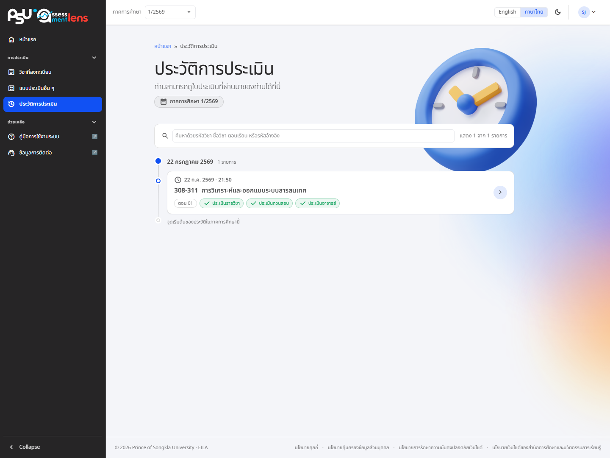

# Evaluation History

<figure><figcaption>
History of submitted course evaluations
</figcaption></figure>

The **"Evaluation History"** page keeps every course evaluation you have **submitted** in one easy table, showing the submission date, the course (code and name), and the status of the form.

To look back at what you answered, press the detail button (Info) to open the submitted form. It opens as a read-only record and cannot be edited.


History is shown for the semester you currently have selected. To look at another term, switch the semester in the top bar of the system.

