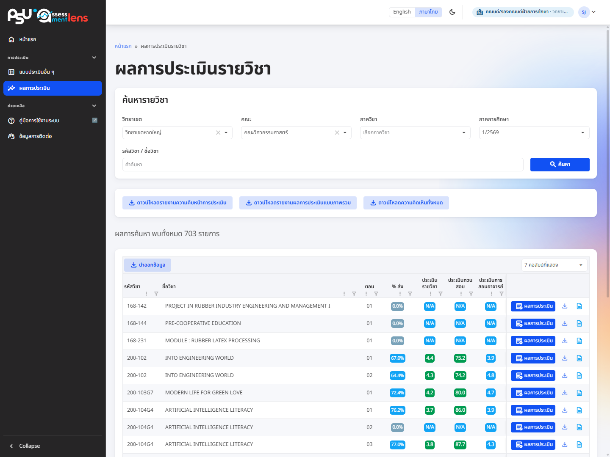

# ผลการประเมินรายวิชา

<figure><figcaption>
หน้าค้นหาและผลการประเมินรายวิชาในรูปแบบตาราง พร้อมปุ่มดาวน์โหลดรายงาน
</figcaption></figure>

ท่านดูผลการประเมินรายวิชาทั้งหมดที่อยู่ในสังกัดของท่านได้จากหน้านี้ ค้นหาได้สะดวกด้วยตัวกรอง วิทยาเขต คณะ ภาควิชา ภาคการศึกษา และคำค้นหา (รหัสวิชาหรือชื่อวิชา)

ผลการค้นหาจะแสดงเป็นตาราง บอกรหัสวิชา ชื่อวิชา ตอน สัดส่วน % ของการส่งใบประเมิน และคะแนนเฉลี่ยของแต่ละประเภท (ประเมินรายวิชา ทวนสอบ และการสอนอาจารย์) อีกทั้งเจาะดูรายละเอียดของแต่ละวิชาได้ เช่น สังกัด อาจารย์ผู้สอน และผลลัพธ์การเรียนรู้ของรายวิชา (CLO)

กดที่ชื่อคอลัมน์เพื่อเรียงลำดับ เช่น เรียงตาม % การส่งหรือคะแนนเฉลี่ยจากมากไปน้อย (กดซ้ำเพื่อสลับทิศทาง กดครั้งที่สามเพื่อยกเลิก) ไอคอนกรวยใต้ชื่อคอลัมน์ใช้กรองข้อมูลในคอลัมน์นั้น และปุ่ม "คอลัมน์ที่แสดง" มุมขวาบนของตารางใช้เปิดคอลัมน์เพิ่ม เช่น ภาค/ปีการศึกษา จำนวนผู้ลงทะเบียน และจำนวนผู้ส่งใบประเมิน ระบบจดจำการตั้งค่าคอลัมน์ไว้ให้ในเครื่องของท่าน

จากตรงนี้ท่านกดดูผลในรูปแบบตาราง หรือดาวน์โหลดเป็นไฟล์ Excel (.xlsx) ก็ได้ ซึ่งหน้าตาเหมือนกับหน้าผลการประเมินของอาจารย์

นอกจากนี้ยังดาวน์โหลดรายงานภาพรวมตามผลการค้นหาได้ทีเดียวหลายแบบ ทั้งรายงานความคืบหน้าการประเมินของทุกวิชาที่ค้นหา รายงานผลการประเมินแบบภาพรวม และรายงานความคิดเห็นทั้งหมด (ไฟล์ Excel .xlsx) เพียงกดปุ่มที่อยู่ถัดจากกล่องค้นหารายวิชา


ผลของรายงานจะขึ้นกับเงื่อนไขที่ค้นหา อยากได้ภาพรวมทั้งหมดให้ค้นหาแบบไม่ระบุวิทยาเขต คณะ ภาควิชา และคำค้นหา ทั้งนี้ ถ้าท่านสังกัดระดับวิทยาเขตหรือคณะ ระบบจะตั้งขอบเขตเริ่มต้นให้เห็นเฉพาะสังกัดของท่านเพื่อความสะดวก

