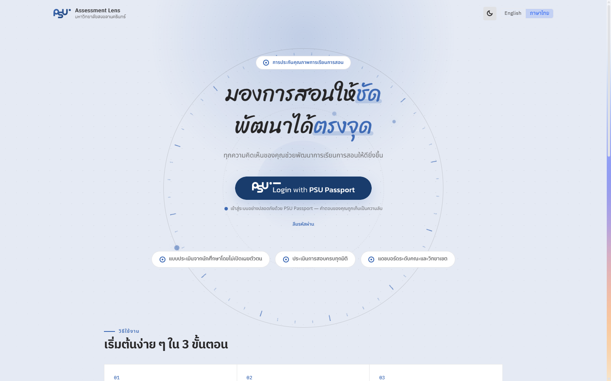

# Login with PSU Passport ลงชื่อเข้าใช้

<figure><figcaption>
หน้าแรกของระบบ PSU Assessment Lens และปุ่มเข้าสู่ระบบด้วย PSU Passport
</figcaption></figure>

## Getting Started

เริ่มต้นการใช้งานระบบด้วยการกดปุ่ม **PSU Passport** ที่หน้าแรก ระบบจะนำทางท่านไปยังเว็บไซต์กลางสำหรับการลงชื่อเข้าใช้ (PSU Passport) ของมหาวิทยาลัยสงขลานครินทร์ เมื่อยืนยันตัวตนสำเร็จ ระบบจะพาท่านกลับเข้าสู่ PSU Assessment Lens โดยอัตโนมัติ

## ช่องทางในการลงชื่อเข้าใช้

ระบบใช้ **PSU Passport** เป็นช่องทางเดียวในการลงชื่อเข้าใช้ ไม่ต้องสมัครสมาชิกใหม่ และไม่มีการเก็บรหัสผ่านไว้ในระบบประเมิน

* **นักศึกษา** ลงชื่อเข้าใช้ด้วยรหัสนักศึกษา หรืออีเมลของนักศึกษา (`รหัสนักศึกษา@email.psu.ac.th` หรือ `รหัสนักศึกษา@psu.ac.th` ขึ้นกับปีที่เข้าศึกษา)
* **อาจารย์ / บุคลากร** ลงชื่อเข้าใช้ด้วย PSU Passport ID หรืออีเมลของบุคลากร (`Passport ID@psu.ac.th`)


**ลืมรหัสผ่าน PSU Passport?** สามารถรีเซ็ตรหัสผ่านได้โดยตรงที่ [onepassport.psu.ac.th](https://onepassport.psu.ac.th) หรือกดลิงก์ "ลืมรหัสผ่าน" ที่หน้าแรกของระบบ หากยังเข้าใช้งานไม่ได้ กรุณาติดต่อศูนย์คอมพิวเตอร์ของวิทยาเขตของท่าน



ที่หน้าแรกและแถบด้านบนของระบบ ท่านสามารถสลับ **โหมดแสง/มืด (Appearance)** และเปลี่ยน **ภาษา (ไทย/อังกฤษ)** ของหน้าจอได้ตามต้องการ


