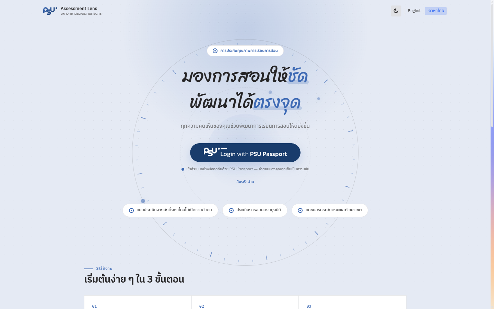

# Login with PSU Passport ลงชื่อเข้าใช้

<figure><figcaption>
หน้าแรกของระบบ PSU Assessment Lens และปุ่มเข้าสู่ระบบด้วย PSU Passport
</figcaption></figure>

## เริ่มต้นใช้งาน

เริ่มใช้งานได้ง่าย ๆ เพียงกดปุ่ม **PSU Passport** ที่หน้าแรก ระบบจะพาท่านไปยังหน้าลงชื่อเข้าใช้กลางของมหาวิทยาลัยสงขลานครินทร์ (PSU Passport) เมื่อยืนยันตัวตนเรียบร้อยแล้ว ระบบจะพาท่านกลับเข้าสู่ PSU Assessment Lens ให้โดยอัตโนมัติ ไม่ต้องตั้งค่าอะไรเพิ่ม

เมื่อเข้าสู่ระบบแล้ว มุมขวาบนจะแสดงบทบาทที่ท่านกำลังใช้อยู่ (เช่น นักศึกษา อาจารย์ หรือผู้บริหาร) ถัดจากรูปโปรไฟล์ ผู้ที่มีหลายบทบาทสลับได้จากเมนูโปรไฟล์ ดูรายละเอียดที่หน้า [ตั้งค่าโปรไฟล์](../lecturer/profile.md)

## ใช้บัญชีอะไรเข้าสู่ระบบ

ระบบใช้บัญชี **PSU Passport** เพียงช่องทางเดียว จึงไม่ต้องสมัครสมาชิกใหม่ และระบบประเมินก็ไม่ได้เก็บรหัสผ่านของท่านไว้ ท่านใช้บัญชีเดิมที่ใช้กับบริการอื่น ๆ ของมหาวิทยาลัยได้เลย

* **นักศึกษา** เข้าสู่ระบบด้วยรหัสนักศึกษา หรืออีเมลของนักศึกษา (`รหัสนักศึกษา@email.psu.ac.th` หรือ `รหัสนักศึกษา@psu.ac.th` แล้วแต่ปีที่เข้าศึกษา)
* **อาจารย์ / บุคลากร** เข้าสู่ระบบด้วย PSU Passport ID หรืออีเมลของบุคลากร (`Passport ID@psu.ac.th`)


**ลืมรหัสผ่าน PSU Passport?** ไม่ต้องกังวล ตั้งรหัสผ่านใหม่ได้เองที่ [onepassport.psu.ac.th](https://onepassport.psu.ac.th) หรือกดลิงก์ "ลืมรหัสผ่าน" ที่หน้าแรกของระบบ หากยังเข้าใช้งานไม่ได้ ติดต่อศูนย์คอมพิวเตอร์ของวิทยาเขตของท่านได้เลย



เปิดระบบครั้งแรกจะมีแถบ **การใช้คุกกี้** ของมหาวิทยาลัยขึ้นที่ด้านล่างกลางจอ ระบบใช้เฉพาะคุกกี้ที่จำเป็นต่อการเข้าสู่ระบบ และคุกกี้ที่จำการตั้งค่าหน้าจอ (ธีม ภาษา) ไม่มีคุกกี้เพื่อการวิเคราะห์หรือการตลาด เลือกยินยอมแล้วแถบจะปิดไป ถ้าอยากเปลี่ยนการตั้งค่าภายหลัง กดปุ่มตั้งค่าคุกกี้ที่มุมขวาล่างของจอได้



ปรับหน้าจอให้ถูกใจได้ตามสะดวก — ที่หน้าแรกและแถบด้านบนของระบบ ท่านสลับ **โหมดสว่าง/มืด** และเปลี่ยน **ภาษา (ไทย/อังกฤษ)** ได้ตลอดเวลา


## เปิดหน้าแล้วขึ้นว่า "บัญชีนี้ไม่มีสิทธิ์เปิดหน้านี้"

หน้านี้แปลว่าท่านเข้าสู่ระบบสำเร็จ แต่หน้าที่เปิดสงวนไว้ให้ผู้ใช้บทบาทอื่น (เช่น เปิดลิงก์หน้าของเจ้าหน้าที่ด้วยบัญชีนักศึกษา) ระบบจะบอกชื่อบัญชีที่ใช้อยู่ และมีปุ่มให้เลือก 2 ทาง

* **กลับหน้าหลัก** — กลับไปใช้งานด้วยบัญชีเดิม
* **สลับบัญชี** — ออกจากระบบแล้วเข้าใหม่ด้วยบัญชีที่มีสิทธิ์ ระบบจะพากลับไปหน้าที่ท่านต้องการให้เอง

ถ้าท่านมีหลายบทบาทในบัญชีเดียว ลองสลับบทบาทจากเมนูโปรไฟล์ก่อน ดูวิธีที่หน้า [ตั้งค่าโปรไฟล์](../lecturer/profile.md)

ถ้าขึ้นว่า **"ไม่มีสิทธิ์เข้าใช้งาน"** แปลว่าบัญชีของท่านยังไม่ได้รับสิทธิ์ใด ๆ ในระบบนี้ กรุณาติดต่อผู้ดูแลระบบเพื่อขอสิทธิ์
