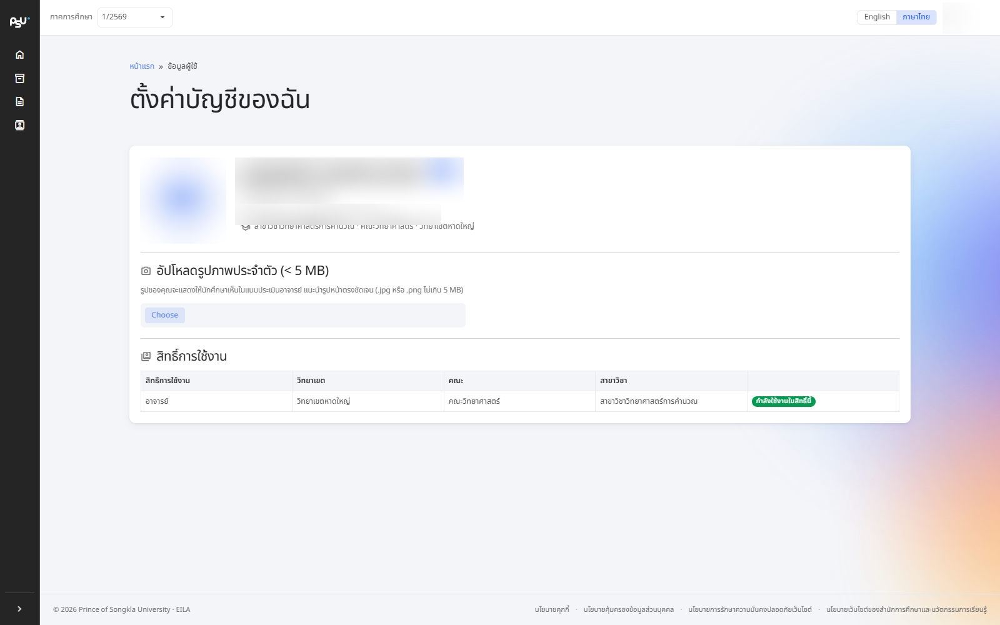

# Profile ตั้งค่าโปรไฟล์

<figure><figcaption>
หน้าตั้งค่าบัญชีของฉัน: ข้อมูลบัญชี รายการสิทธิ์การใช้งาน และการอัปโหลดรูปภาพ
</figcaption></figure>

เข้าหน้านี้ได้จากเมนูมุมขวาบนของระบบ โดยกดที่ชื่อของท่านแล้วเลือกโปรไฟล์ ระบบจะพาท่านมายังหน้า **"ตั้งค่าบัญชีของฉัน"** ซึ่งแสดงข้อมูลบัญชี (ชื่อไทย/อังกฤษ อีเมล ชื่อผู้ใช้) สังกัด (ภาควิชา · คณะ · วิทยาเขต) และสิทธิ์การใช้งานของท่าน

## สลับสิทธิ์การใช้งาน

หากท่านมีสิทธิ์การใช้งานมากกว่า 1 สิทธิ์ ระบบจะแสดงรายการสิทธิ์ทั้งหมด สิทธิ์ที่ใช้อยู่จะขึ้นว่า **"กำลังใช้งานในสิทธิ์นี้"** ส่วนสิทธิ์อื่นจะมีปุ่ม **"ใช้บทบาทนี้"** เมื่อกดจะมีหน้าต่างยืนยันก่อนสลับสิทธิ์

## รูปภาพประจำตัว

สำหรับอาจารย์ (และผู้ประสานงานรายวิชา) สามารถอัปโหลดรูปภาพประจำตัวได้ ขนาดไม่เกิน **5 MB** รองรับไฟล์ `.jpg` และ `.png` รูปนี้จะแสดงให้นักศึกษาเห็นในแบบประเมินการสอนของอาจารย์ และสามารถกดลบรูปออกได้


ควรอัปโหลดรูปที่เหมาะสมและเห็นใบหน้าชัดเจน เพื่อการประเมินอาจารย์ที่มีประสิทธิภาพมากขึ้น



นักศึกษาไม่จำเป็นต้องใช้รูปโปรไฟล์ เนื่องจากคำตอบการประเมินถูกเก็บเป็นความลับ

