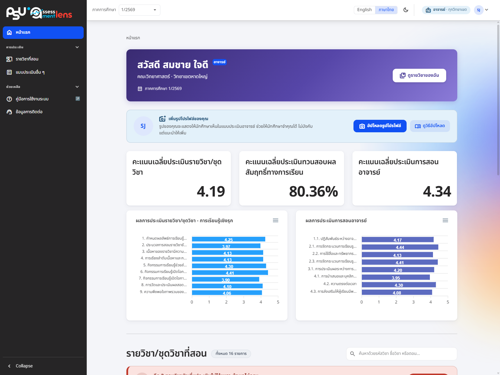
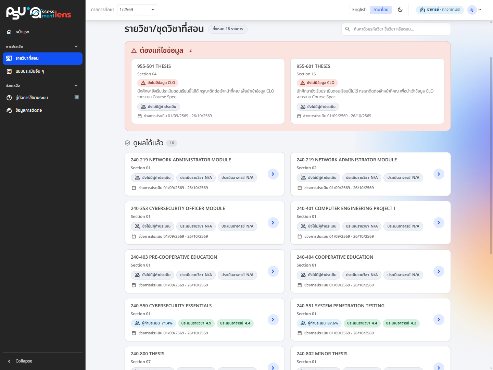

# ภาพรวมผลการประเมินและรายวิชาที่สอน

<figure><figcaption>
หน้าแรกของอาจารย์: ภาพรวมคะแนนและรายวิชาที่สอน
</figcaption></figure>

เมื่ออาจารย์เข้าสู่ระบบ หน้าแรกจะทักทายท่านพร้อมบอกสิทธิ์การใช้งาน คณะ/วิทยาเขต และภาคการศึกษาปัจจุบัน พร้อมปุ่มลัด **"รายวิชาของฉัน"** ให้กดเข้าไปดูวิชาที่สอนได้ทันที

ถัดลงมาเป็นภาพรวมคะแนนเฉลี่ยของการประเมินแต่ละประเภท ช่วยให้ท่านเห็นผลโดยรวมได้ในหน้าเดียว

* คะแนนเฉลี่ยการประเมินรายวิชา/ชุดวิชา
* ผลการประเมินตนเองของนักศึกษาตามผลลัพธ์การเรียนรู้ของรายวิชา (CLO) ระบบเชื่อมกับ Course Spec. และแปลผลออกมาเป็นระดับผลสัมฤทธิ์ คือ ตั้งแต่ 50% ขึ้นไป หรือ ต่ำกว่า 50%
* คะแนนเฉลี่ยการประเมินการสอนของอาจารย์ คิดจากคะแนนของท่านเองเท่านั้น ไม่รวมอาจารย์ท่านอื่นที่สอนตอนเดียวกัน และจะไม่นับผู้ที่เลือก N/A หรือไม่แสดงความคิดเห็นมารวมในค่าเฉลี่ย ตัวเลขจึงสะท้อนเฉพาะผู้ที่ให้คะแนนจริง

ภาพรวมนี้นับเฉพาะตอนเรียนที่ท่านสอนเอง

## รายวิชา/ชุดวิชาที่สอน

ระบบจะแสดงรายวิชาทั้งหมดที่ท่านสอน แต่ละวิชาบอกรหัสวิชา ชื่อวิชา ตอน สัดส่วนนักศึกษาที่ส่งแบบประเมินแล้วเทียบกับจำนวนที่ลงทะเบียน และสถานะช่วงการประเมิน


เพื่อความเป็นธรรมและความลับของผู้ประเมิน อาจารย์จะเข้าดูผลได้หลังจากพ้นช่วงการประเมิน **และ** มีการเปิด/ส่งระดับคะแนนของรายวิชานั้นแล้วเท่านั้น


<figure><figcaption>
รายวิชาที่สอน แสดงสัดส่วนผู้ส่งใบประเมินและคะแนนเฉลี่ยเมื่อผลถูกเปิดให้ดูแล้ว
</figcaption></figure>

เมื่อพ้นช่วงการประเมินและผลถูกเปิดให้ดูแล้ว การ์ดรายวิชาจะเปลี่ยนมาแสดงคะแนนเฉลี่ย กดเข้าไปดูผลการประเมินแบบละเอียดได้เลย มีวิชาเยอะก็พิมพ์รหัสวิชา ชื่อวิชา หรือตอนในช่องค้นหามุมขวาบนเพื่อกรองการ์ดได้

รายวิชาถูกจัดเป็นกลุ่มตามสถานะ

* **ต้องแก้ไขข้อมูล** — ตอนเรียนที่ข้อมูลยังไม่ครบ เช่น ยังไม่มีข้อมูล CLO จากระบบ Course Spec. นักศึกษาจะยังเริ่มประเมินตอนเรียนนี้ไม่ได้ กรุณาติดต่อเจ้าหน้าที่คณะเพื่อนำเข้าข้อมูล กลุ่มนี้จะแสดงเฉพาะเมื่อมีวิชาที่ต้องแก้ไข และหน้าแรกจะมีแถบเตือนบอกจำนวนไว้ด้วย
* **ดูผลได้แล้ว** — ตอนเรียนที่พร้อมใช้งาน แสดงสัดส่วนผู้ทำประเมินและคะแนนเฉลี่ยเมื่อมีผลแล้ว


ถ้าท่านเป็นอาจารย์ผู้ประสานงานรายวิชาของตอนเรียนที่ท่านไม่ได้สอนเอง การ์ดของตอนนั้นจะแสดงเฉพาะสัดส่วนผู้ทำประเมินและความพร้อมของข้อมูล ไม่แสดงคะแนน และกดเข้าไปดูผลไม่ได้ เพราะผลการประเมินเป็นของอาจารย์ผู้สอนตอนนั้น

