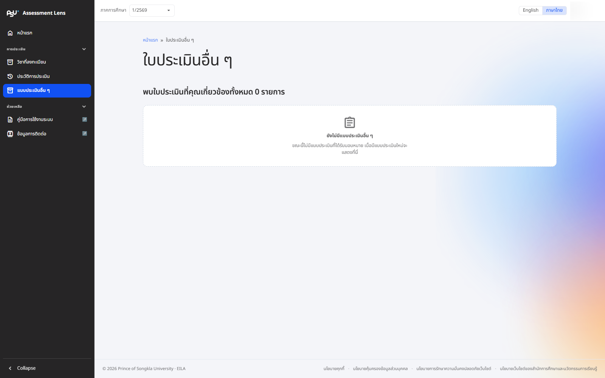

# ใบประเมินอื่น ๆ ที่คุณเกี่ยวข้อง

นอกจากการประเมินรายวิชาแล้ว ระบบยังมี **แบบประเมินอื่น ๆ** ที่เจ้าหน้าที่/หน่วยงานสร้างขึ้นและมอบหมายให้ท่านทำ เช่น แบบสำรวจหรือแบบประเมินเฉพาะกิจ เข้าถึงได้จากเมนู **"แบบประเมินอื่น ๆ"** ทางแถบด้านซ้าย เมนูนี้แสดงให้ผู้ใช้ทุกสิทธิ์


แบบประเมินอื่น ๆ จะแสดงก็ต่อเมื่อท่านมีชื่ออยู่ในรายชื่อผู้ที่ต้องทำแบบประเมินนั้น ๆ หากยังไม่มีการมอบหมาย รายการจะว่าง


## รายการแบบประเมิน

<figure><figcaption>
หน้าแบบประเมินอื่น ๆ เมื่อยังไม่มีแบบประเมินที่ได้รับมอบหมาย
</figcaption></figure>

ระบบจะแสดงแบบประเมินที่มอบหมายให้ท่านในรูปแบบการ์ด แบ่งเป็น 2 กลุ่ม

* **กำลังดำเนินการ** — แบบประเมินที่ยังไม่ได้ส่ง
* **ดำเนินการเสร็จสิ้น** — แบบประเมินที่ส่งแล้ว

แต่ละการ์ดจะแสดงชื่อแบบประเมิน ผู้สร้าง และช่วงเวลาการประเมิน กดที่การ์ดเพื่อเข้าทำแบบประเมิน

## การทำและส่งแบบประเมิน

ในหน้าแบบประเมินจะแสดงชื่อและคำอธิบายของแบบประเมิน ผู้สร้าง (**สร้างแบบประเมินโดย**) และช่วงเวลาการประเมิน พร้อมแถบความคืบหน้าและปุ่ม **บันทึก** / **ส่งใบประเมิน**

ท่านสามารถตอบตามหัวข้อที่กำหนดและใส่ข้อเสนอแนะได้ เมื่อกด **ส่งใบประเมิน** จะมีหน้าต่างยืนยันการส่ง


หลังจากส่งแบบประเมินแล้ว จะไม่สามารถแก้ไขคำตอบได้อีก กรุณาตรวจสอบความถูกต้องก่อนกดยืนยัน

