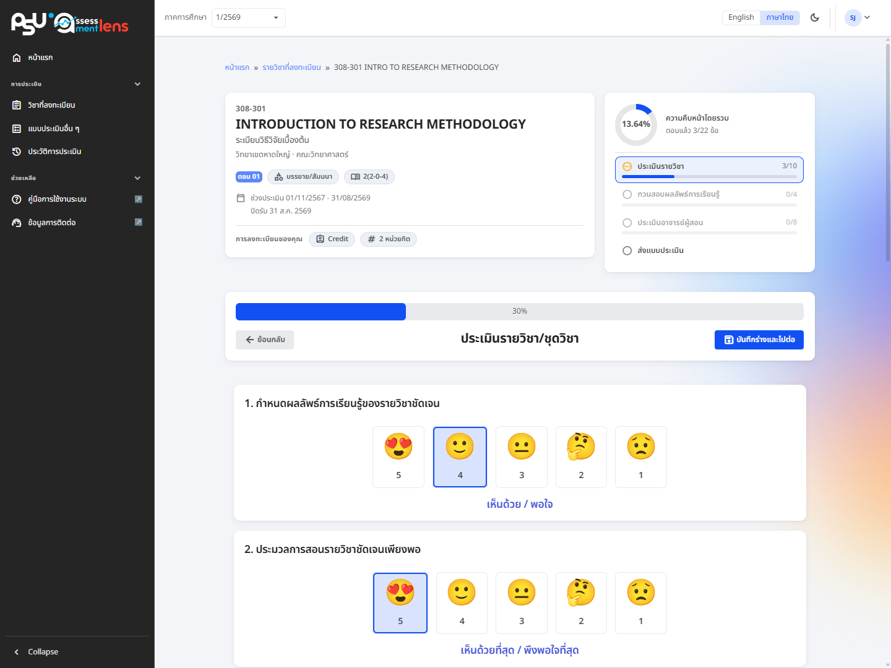
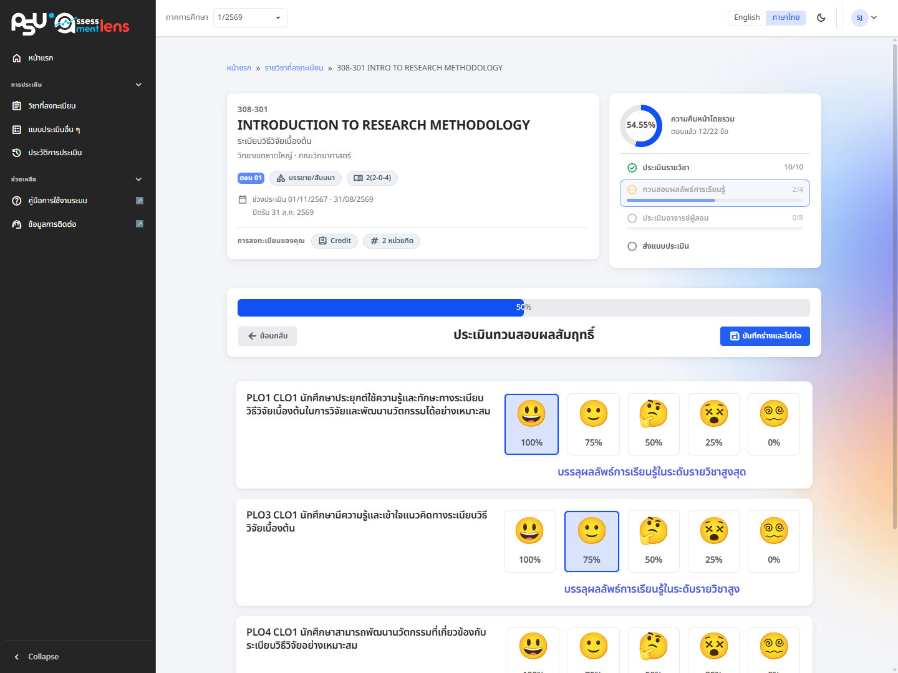
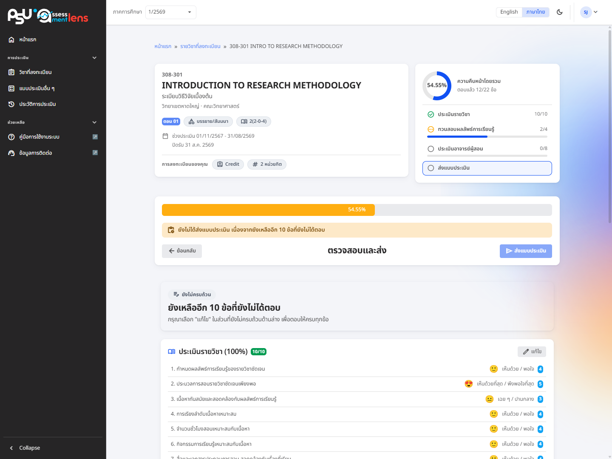

# Evaluation Form ประเมินรายวิชา

การประเมิน 1 วิชาจะมี **3 ส่วน** ทำไล่ไปตามลำดับ และปิดท้ายด้วยแท็บ **"ตรวจสอบและส่ง"** ท่านทำทีละส่วนไปเรื่อย ๆ ส่วนถัดไปจะปลดล็อกให้เองเมื่อผ่านส่วนก่อนหน้า ระหว่างทางมีแถบแสดงความคืบหน้า (progress rail) อยู่ด้านข้างคอยบอกว่าแต่ละส่วนทำไปถึงไหนแล้ว จะกดส่งได้ก็ต่อเมื่อตอบครบทุกส่วน ใช้เวลาไม่นานเลย

* บางข้อยังไม่อยากตอบตอนนี้ก็ข้ามไปก่อนได้ แล้วค่อยกลับมาตอบภายหลัง
* ปุ่ม **"บันทึกร่างและไปต่อ"** มุมขวาบนของแต่ละส่วน ช่วยเก็บคำตอบไว้ก่อน (ยังไม่ส่ง) และพาไปส่วนถัดไปในคลิกเดียว ออกจากหน้านี้แล้วกลับมาทำต่อเมื่อไรก็ได้

ด้านบนของแบบประเมินจะบอกรายละเอียดวิชา (รหัสวิชา ชื่อวิชา ตอน หน่วยกิต) พร้อมแถบความคืบหน้าและปุ่มย้อนกลับ

## 1. ประเมินรายวิชา/ชุดวิชา

<figure><figcaption>
แบบประเมินรายวิชา/ชุดวิชา พร้อมแถบความคืบหน้าด้านข้าง
</figcaption></figure>

ส่วนนี้เป็นการสะท้อนว่ารายวิชา/ชุดวิชาให้ผลดีแค่ไหน ประกอบด้วยหัวข้อให้เลือกตอบ และมีช่องแสดงความคิดเห็น (ข้อเสนอแนะ) ท้ายส่วน เผื่อท่านอยากเล่าเพิ่มด้วยตัวเอง

***

## 2. ประเมินทวนสอบผลสัมฤทธิ์

<figure><figcaption>
แบบประเมินทวนสอบผลสัมฤทธิ์
</figcaption></figure>

ส่วนนี้ให้ท่านสะท้อนว่าเรียนแล้วเข้าใจตาม **สิ่งที่รายวิชาตั้งใจให้ได้เรียนรู้** มากน้อยแค่ไหน — สิ่งเหล่านี้เรียกว่า "ผลลัพธ์การเรียนรู้ของรายวิชา (CLO)" หัวข้อในส่วนนี้จึงเป็นผลลัพธ์การเรียนรู้ของวิชานั้น ๆ นั่นเอง

***

## 3. ประเมินอาจารย์

ส่วนนี้จะแสดงรายชื่ออาจารย์ผู้สอน (พร้อมรูปประจำตัว ถ้าอาจารย์อัปโหลดไว้) หัวข้อการประเมินแบ่งเป็น 4 ด้านหลัก บางวิทยาเขตหรือบางคณะอาจมีมากกว่านั้น และถ้ามีอาจารย์หลายท่าน ท่านให้ข้อเสนอแนะแยกเป็นรายอาจารย์ได้ที่ท้ายส่วน

***

## 4. ตรวจสอบและส่ง

แท็บ **"ตรวจสอบและส่ง"** จะรวบคำตอบของทั้ง 3 ส่วนมาให้ทวนอีกรอบก่อนส่ง ถ้ายังมีข้อไหนตกหล่น ระบบจะบอกว่าเหลืออีกกี่ข้อ และยังไม่ให้ส่งจนกว่าจะตอบครบ หมดห่วงเรื่องส่งไม่ครบ

<figure><figcaption>
แท็บตรวจสอบและส่ง สรุปความคืบหน้าของแต่ละส่วนและแจ้งจำนวนข้อที่ยังไม่ได้ตอบ
</figcaption></figure>

## การส่งแบบประเมิน

ปุ่ม **"ส่งแบบประเมิน"** อยู่มุมขวาบนของแถบหัวข้อในแท็บ "ตรวจสอบและส่ง" (ที่เดียวกับปุ่ม "บันทึกร่างและไปต่อ" ของส่วนก่อนหน้า) กดแล้วจะมีหน้าต่างให้ยืนยันอีกครั้ง


เมื่อยืนยันส่งแล้ว จะ **แก้ไขคำตอบไม่ได้อีก** จึงควรตรวจทานให้เรียบร้อยก่อนกดยืนยันนะครับ/คะ



ตอบครบแล้วแต่ยังไม่ได้กดส่ง แล้วเผลอจะออกจากหน้านี้ ระบบจะเตือนให้ก่อน เพราะแบบประเมินจะยังไม่ถูกนับจนกว่าจะกดส่ง

