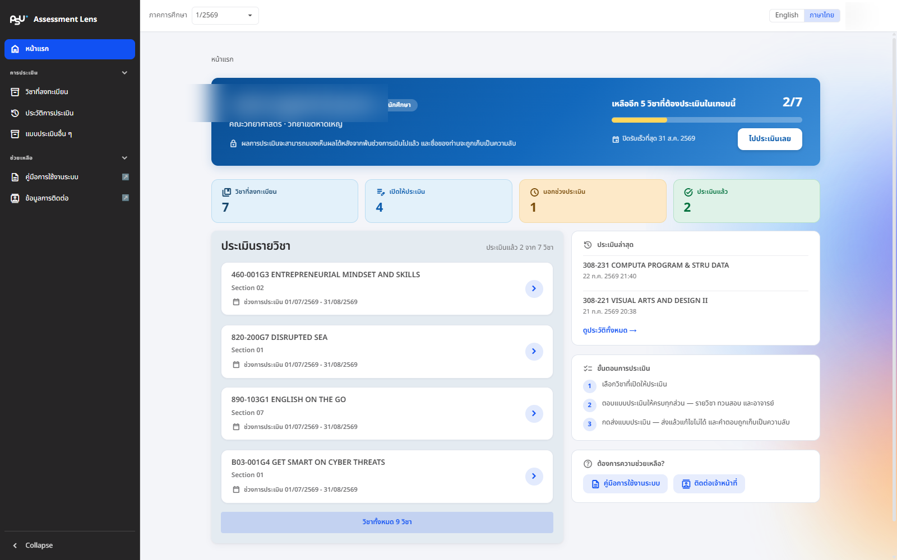

# Homepage ภาพรวมทั้งหมด

เมื่อเข้าสู่ระบบสำเร็จ ระบบจะพาท่านมาที่ **หน้าแรก** ซึ่งรวบรวมทุกอย่างที่ท่านต้องรู้เกี่ยวกับการประเมินในภาคการศึกษานี้ไว้ในที่เดียว มองปุ๊บก็รู้ว่าเหลืออะไรต้องทำบ้าง

## แถบสรุปความคืบหน้า

ด้านบนสุดจะมีแถบต้อนรับที่ทักทายท่านด้วยชื่อ พร้อมบอกสิทธิ์การใช้งาน (นักศึกษา) คณะและวิทยาเขต และย้ำให้สบายใจว่า **คำตอบของท่านถูกเก็บเป็นความลับ**

ถัดลงมาเป็นแถบสรุปความคืบหน้า ช่วยให้ท่านติดตามได้ในพริบตาว่า

* ประเมินไปแล้วกี่วิชา จากทั้งหมดกี่วิชา พร้อมแถบความคืบหน้าให้เห็นภาพชัด ๆ
* วิชาที่ใกล้ปิดรับการประเมินมากที่สุด จะได้ไม่พลาด
* ปุ่ม **"ไปประเมินเลย"** กดแล้วเข้าสู่หน้ารายวิชาได้ทันที

ประเมินครบทุกวิชาเมื่อไร แถบนี้จะเปลี่ยนเป็นข้อความขอบคุณให้ชื่นใจ

## สรุปการประเมินรายวิชา

<figure><figcaption>
หน้าแรกของนักศึกษา: แถบความคืบหน้า ชิปสถิติ สรุปการประเมิน และประเมินล่าสุด
</figcaption></figure>

ระบบจะนับให้ว่าท่านต้องประเมินกี่วิชา ทำไปแล้วกี่วิชา พร้อมยกตัวอย่างรายวิชาบางส่วนมาแสดง และมีชิปสถิติสรุปจำนวนวิชาแยกตามสถานะ ได้แก่ วิชาที่ลงทะเบียน วิชาที่เปิดให้ประเมิน วิชาที่อยู่นอกช่วงประเมิน และวิชาที่ประเมินแล้ว

อยากดูให้ครบทุกวิชา กดปุ่ม **"รายวิชาทั้งหมด"** หรือเข้าเมนู **"รายวิชาที่ลงทะเบียน"** ทางแถบเมนูด้านซ้ายได้เลย

***

## สรุปแบบประเมินอื่น ๆ ที่เกี่ยวข้องกับท่าน

ระบบจะสรุปว่ามีแบบประเมินอื่น ๆ ที่เกี่ยวข้องกับท่านกี่รายการ ทำเสร็จไปแล้วเท่าไร พร้อมแสดงตัวอย่างบางรายการ


ส่วนนี้จะแสดงก็ต่อเมื่อท่านมีชื่ออยู่ในรายชื่อผู้ที่ต้องทำแบบประเมินนั้น ๆ ดูรายละเอียดเพิ่มเติมได้ที่หน้า [แบบประเมินอื่น ๆ](../other-evaluation/all-forms.md)


***

## ประเมินล่าสุด ขั้นตอนการประเมิน และความช่วยเหลือ

ด้านล่างของหน้าแรกยังมีตัวช่วยอีกสามส่วน

* **ประเมินล่าสุด** — รายการที่ท่านเพิ่งส่งไป พร้อมลิงก์ไปดู [ประวัติการประเมิน](history.md) ทั้งหมด
* **ขั้นตอนการประเมิน** — สรุปวิธีใช้งานสั้น ๆ เพียง 3 ขั้นตอน
* **ต้องการความช่วยเหลือ?** — ลิงก์ไปคู่มือการใช้งานและช่องทางติดต่อเจ้าหน้าที่ เผื่อติดขัดตรงไหน
